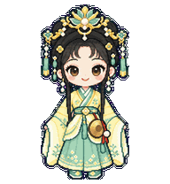
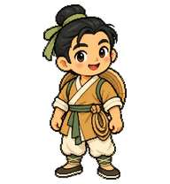
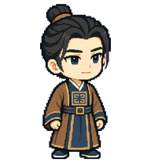

# Codex Opera Pets · 戏曲萌宠

黄梅戏主题的开源 Codex 动画宠物合集，持续收录经典剧目角色，以卡通动画呈现戏服、身段与角色个性。

目前收录 **5 只完整动画宠物**。静态主形象另列，不计入可安装宠物数量。

## 角色目录

| 预览 | 角色 | 所属剧目 | 专属标志 | 下载 |
| --- | --- | --- | --- | --- |
|  | [梅小水](pets/original/mei-xiao-shui/README.md) | 原创黄梅戏主题 | 淡黄水绿戏服＋凤冠＋小锣 | [宠物 ZIP](downloads/mei-xiao-shui.zip) |
|  | [冯素珍·状元版](pets/nv-fu-ma/nv-fu-ma-feng-su-zhen-zhuangyuan/README.md) | 女驸马 | 朱红状元袍＋短横翅乌纱帽 | [宠物 ZIP](downloads/nv-fu-ma-feng-su-zhen-zhuangyuan.zip) |
|  | [陶金花](pets/da-zhu-cao/da-zhu-cao-tao-jin-hua/README.md) | 打猪草 | 桃红嫩绿围裙装＋三叶草篮 | [宠物 ZIP](downloads/da-zhu-cao-tao-jin-hua.zip) |
|  | [李兆廷](pets/nv-fu-ma/nv-fu-ma-li-zhao-ting/README.md) | 女驸马 | 青灰斜边领长衫＋无字线装书 | [宠物 ZIP](downloads/nv-fu-ma-li-zhao-ting.zip) |
|  | [公主](pets/nv-fu-ma/nv-fu-ma-gong-zhu/README.md) | 女驸马 | 绛紫扇形小宫冠＋花纹团扇 | [宠物 ZIP](downloads/nv-fu-ma-gong-zhu.zip) |

凤冠与小锣只属于梅小水；其他已登记的具体服饰与道具同样不可跨角色复用。

## 三种主要动作

| 工作：挥水袖 | 等待操作：敲小锣 | 完成：谢幕 |
| --- | --- | --- |
|  |  |  |

另含待机、左右移动、招手、出错、检查结果，以及 16 个视线方向。敲锣是视觉动画，不包含音频。

## 安装

下载上方 ZIP 并解压，将其中 `mei-xiao-shui` 文件夹放入 Codex 自定义宠物目录：

- Windows：`%USERPROFILE%\.codex\pets\`
- macOS / Linux：`~/.codex/pets/`
- 如果设置了 `CODEX_HOME`，使用该目录下的 `pets/`。

最终应存在 `pets/mei-xiao-shui/pet.json` 与 `pets/mei-xiao-shui/spritesheet.webp`。仓库的剧目分组不用复制到安装目录。然后在 Codex 的宠物设置中刷新并选择「梅小水」；必要时重新启动应用。

## 格式与验证

发布包采用 sprite v2：8×11 图集、1536×2288 像素、192×208 单格，含 9 种标准状态与 16 个视线姿态。

每个角色提供图集、动图预览、SHA-256 和脱敏验证摘要。梅小水已通过结构、透明边缘及方向盲测检查，逐帧视觉复核通过并保留轻微差异说明；尚未验证应用内实际播放。详见 [验证摘要](pets/original/mei-xiao-shui/qa/validation-summary.json)。

## 主形象参考（尚非动画包）

以下仅完成静态角色形象，动画尚待制作。

| 预览 | 角色 | 专属标志 |
| --- | --- | --- |
|  | [牛郎](designs/niu-lang-zhi-nv/niu-lang-zhi-nv-niu-lang/README.md) | 背系草帽＋腰间短粗绳圈 |
|  | [织女](designs/niu-lang-zhi-nv/niu-lang-zhi-nv-zhi-nv/README.md) | 月蓝织纹窄袖衣＋银白小织梭 |
|  | [陈赛金](designs/luo-pa-ji/luo-pa-ji-chen-sai-jin/README.md) | 豆沙宽边素裙＋宽边花角罗帕 |
|  | [王科举](designs/luo-pa-ji/luo-pa-ji-wang-ke-ju/README.md) | 赭棕藏青方块胸纹袍＋旧金方扣宽腰封 |

## 后续收录

目录采用 `pets/<剧目标识>/<角色标识>/`，原创角色使用 `pets/original/`。同名角色的不同剧目版本分别建档，安装 ID 保持全库唯一。每个角色记录剧目、行当、造型参考、动作设计及素材许可，未核实内容保留空值。

欢迎按 [贡献说明](CONTRIBUTING.md) 提交新角色。当前宠物由内置 imagegen 生成并经拆帧、对齐与检查，是戏曲主题卡通演绎，不作为历史戏服或特定演员表演的复原。

## 许可与署名

除单独标明的第三方内容外，本仓库发布的原创素材和文档采用 **[CC BY 4.0](LICENSE)**。推荐署名：

> 梅小水 / Codex Opera Pets，wzf-cn，CC BY 4.0。来源：https://github.com/wzf-cn/codex-opera-pets

使用或改编时请保留作者、来源和许可信息，并说明修改。项目为独立社区作品，与 OpenAI 无隶属或背书关系。
