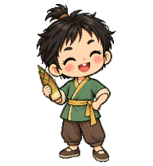

# 金小毛 · 卡通人偶主形象

黄梅戏《打猪草》金小毛。看守竹笋，与陶金花由误会到和解，随后对花同行。本系列将其设计为俏皮、坦率、爱较真但容易和好；与陶金花是互相应答的设计关系。专属形象标志为【翠绿卷袖短衣＋圆钝小竹笋】，仅由本角色使用，其他人物不得借用。

专属标志：**翠绿卷袖短衣＋圆钝小竹笋**，其他角色不得借用。

本页保留静态主形象参考。完整动画卡通人偶已发布，请从仓库首页下载对应角色的动画包。

作者：wzf-cn。许可：CC BY 4.0。内置 imagegen 生成，经过独立视觉检查；属于戏曲主题卡通设计，不作为特定演出服饰的复原。
