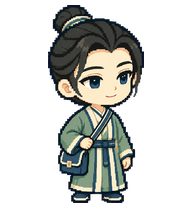

# 梁山伯 · 主形象

黄梅戏《梁山伯与祝英台》梁山伯。黄梅戏亦有该剧舞台版本。首版取青年书生形象，不照搬越剧或香港黄梅调电影造型。本系列将其设计为诚恳、专心、略显朴拙；与李兆廷的清雅长衫作区别。专属形象标志为【竹青双竖襟长衫＋方形翻盖书袋】，仅由本角色使用，其他人物不得借用。

专属标志：**竹青双竖襟长衫＋方形翻盖书袋**，其他角色不得借用。

当前为静态主形象，尚不是可安装的动画包。工作、等待与谢幕动画待制作。

作者：wzf-cn。许可：CC BY 4.0。内置 imagegen 生成，经过独立视觉检查；属于戏曲主题卡通设计，不作为特定演出服饰的复原。
