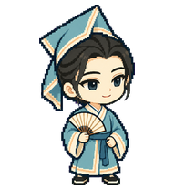

# 祝英台·书装版 · 主形象

黄梅戏《梁山伯与祝英台》祝英台·书装版。首版采用女扮男装求学的故事形象；具体黄梅戏演出版本的服饰仍待选定。本系列将其设计为聪慧、主动、富有好奇；眼神比梁山伯活跃，姿态更挺拔。专属形象标志为【湖蓝三角折巾＋半开竹骨折扇】，仅由本角色使用，其他人物不得借用。

专属标志：**湖蓝三角折巾＋半开竹骨折扇**，其他角色不得借用。

当前为静态主形象，尚不是可安装的动画包。工作、等待与谢幕动画待制作。

作者：wzf-cn。许可：CC BY 4.0。内置 imagegen 生成，经过独立视觉检查；属于戏曲主题卡通设计，不作为特定演出服饰的复原。
