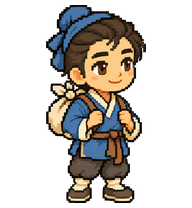

# 董永 · 卡通人偶主形象

黄梅戏《天仙配》董永。贫寒劳动者，与七仙女结为夫妻；质朴、诚恳是设计提取。本系列将其设计为可靠、踏实、略腼腆；像安静把活做完的伙伴。专属形象标志为【肘部方补丁靛蓝短衫＋十字结软包袱】，仅由本角色使用，其他人物不得借用。 方补丁缝在袖子覆盖肘尖的位置，即肘关节后方、做平板支撑时接触地面的部位；不在肘关节侧面、上臂或前臂侧边。补丁随肘部弯曲和遮挡自然变化，不为露出补丁而把它移到侧面。

当前为静态主形象，尚不是可安装的动画包。补丁位置已按肘尖修正，现有动画仍需同步复查。

作者：wzf-cn。许可：CC BY 4.0。内置 imagegen 生成并经过视觉检查；透明 PNG。属于戏曲主题卡通设计，不作为特定演出服饰的复原。
